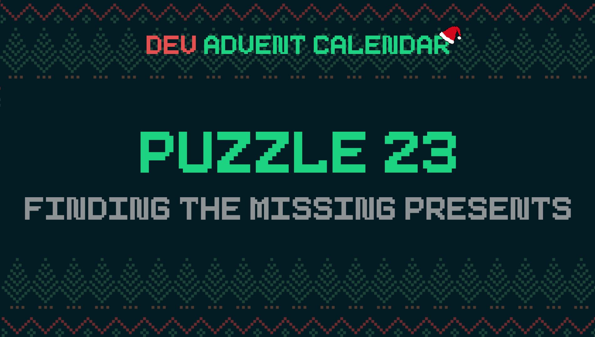

ℹ️ For detailed information about the contest, check out [devadvent/readme](https://github.com/devadvent/readme/)

# Dev Advent Calendar 🎅 Puzzle 23 - Find The Missing Presents 🎁

🚨 RED ALERT AT THE NORTH POLE 🚨

Some of the presents are missing! 😱

There are items on the manifest (what should be delivered) that are not in Santa's sack for his first round.
Write a program that helps Santa find out which are the items that are missing.

## 🧩 The puzzle

In the file [src/data/items.js](src/data/items.js), there is a sample data of all the items in the database.

However, the manifest only has a subset of those items (since the sack is being filled multiple times, depending on the region of delivery).
Also, the manifest only has the IDs, but not the name of the item. Santa and the elves need the name in order to resolve the crisis faster.

Complete the function `findMissing` in the file [src/utils/missing.js](src/utils/missing.js)!
The function takes two parameters:

-   `manifest`: Array of IDs that _should_ be delivered
-   `sack`: Array of IDs that are actually in Santa's sack.

As a result, return an array with the entire object (ID and name) of the item (from [src/data/items.js](src/data/items.js)).

For example:

```javascript
result => [
    { id: '2f03e2fb-f66f-4fa7-903d-3e4333a1bb62', name: 'Magic Kit' },
    { id: '0825436e-8055-4be3-8c05-fd097378e2b7', name: 'eScooter' },
]
```

## 🚢 Ship your solution

Check out the [contributing guide](https://github.com/devadvent/readme/blob/main/CONTRIBUTING.md) for details about how to participate.

In short:

-   ✨ Create your repository by [acceping the assignment](https://classroom.github.com/a/-GjzDXu3) using the participation link
-   🧩 Solve the puzzle
-   🐦 Add your Twitter handle to `twitter.js`
-   🤖 Test your solution
-   🚀 Upload your changes to the `main` branch

## 🔗 Participation link

In order to participate, you need to enter the following link and accept the assignment:
[https://classroom.github.com/a/-GjzDXu3](https://classroom.github.com/a/-GjzDXu3)

## 💻 Use this project

### ⏳ Install the dependencies

Install the dependencies with

```bash
yarn install
```

or

```bash
npm install
```

### ⚙️ Run the code

Run the code with

```bash
yarn dev
```

or

```bash
npm run dev
```

### 🤖 Test your solution

This puzzle is equipped with automated tests (in the `./tests` folder). In order for your solution to qualify for winning the daily prize, **all** tests need to pass.

To run these tests, execute one of the following commands in your console:

```bash
yarn test
```

or

```bash
npm test
```

```

```
